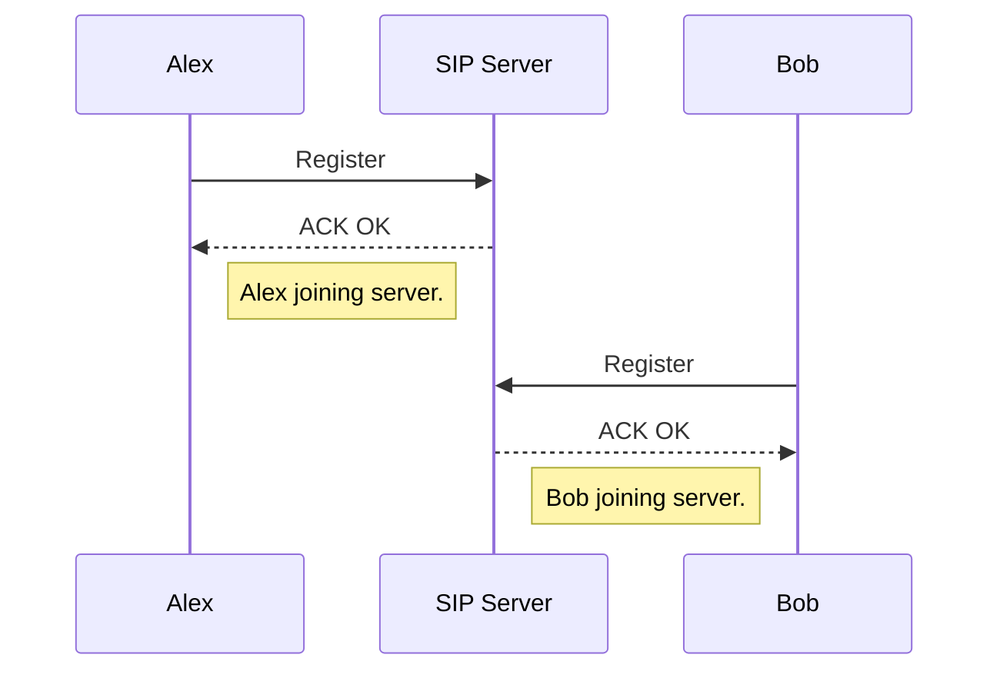
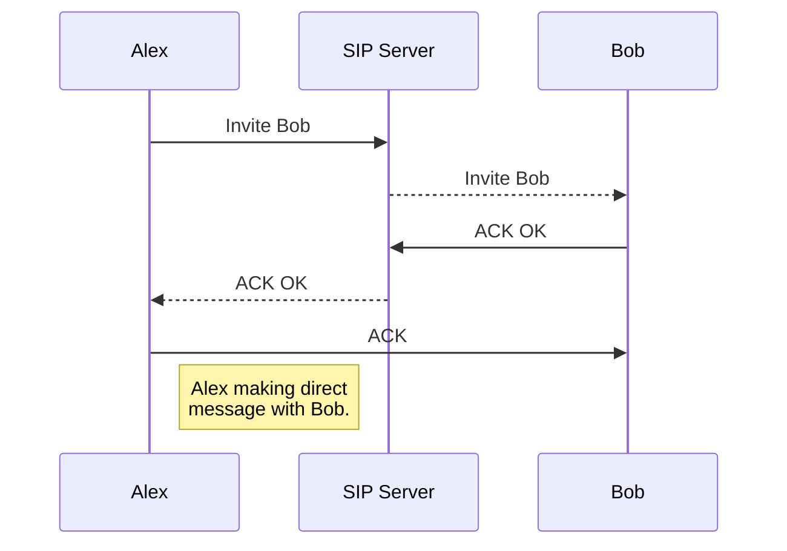

# One-on-One RCS Chat
## About
This project for creating a **one to one chat system** which simulates messaging using Rich Communication Services (**RCS**) standards defined by the GSMA. **Python socket library** is used to create a message generating platform and **OpenSips** is used to handle **SIP** (Session Initiation Protocol) messages during creation and management of a session.

## Installation Instruction

```
# Required OS packages
sudo apt-get install -y git make bison flex mysql-server mysql-client libmysqlclient-dev libncurses5 libncurses5-dev
sudo apt install python3 python3-pip python3-dev gcc default-libmysqlclient-dev

# Required python3 packages
sudo pip3 install mysqlclient sqlalchemy sqlalchemy-utils pyOpenSSL
```
### Source code

Download the source code from the GitHub repository and install.
```
git clone https://github.com/tusg25/1on1-chat-using-sip
cd 1on1-chat-using-sip/
```
### Install opensips
```
cd opensips-3.0.2/
sudo make all
sudo make install
```
To install **db_mysql** module 
```
make install include_modules="db_mysql"
```
### Install opensips-cli
```
cd ../opensips-cli
sudo python3 setup.py install clean
cd ../
```
### Database Deployment
Set up database using opensips-cli config file:
```
sudo opensips-cli -f opensips-cli.cfg -x database create
```

## Run
> **Note:**  localhost is used as IP for server and user for simplicity but can can be changed in config.cfg and user.py file.

|  | IP:PORT |
| :--: | :------: | 
| SIP Server | 127.0.0.1:5060 |
| User | 127.0.0.1:Random |


```
# Start a SIP server (OpenSips acting as SIP proxy Server)
sudo opensips -f config.cfg
# Start users in new bash sessions
python3 user.py
```

## Simulation and Description
Registration

Messaging
